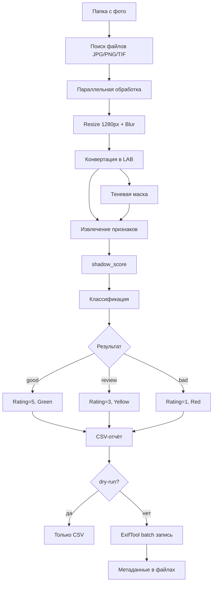
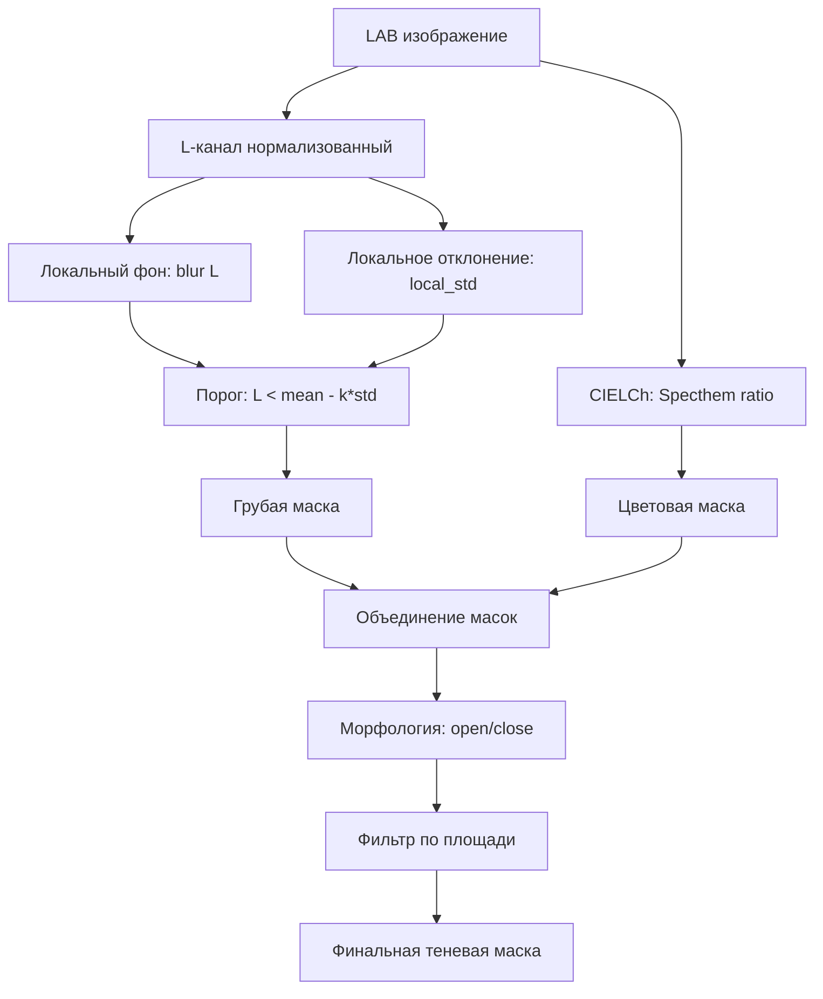
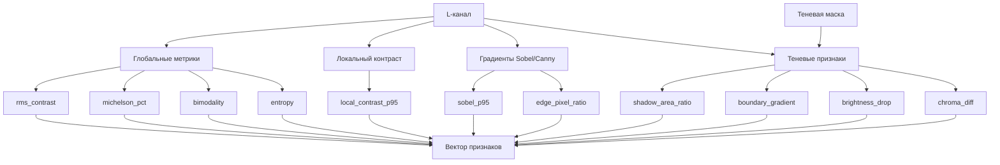
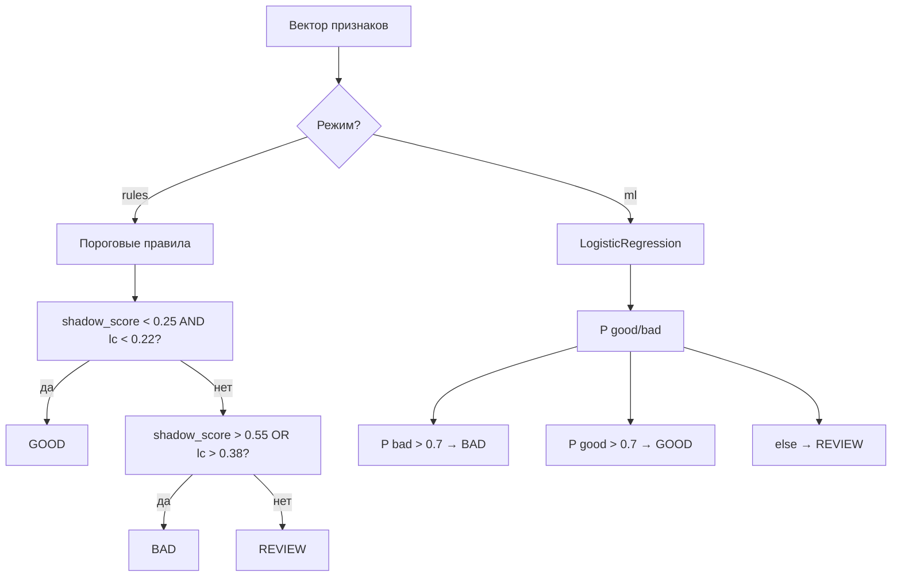
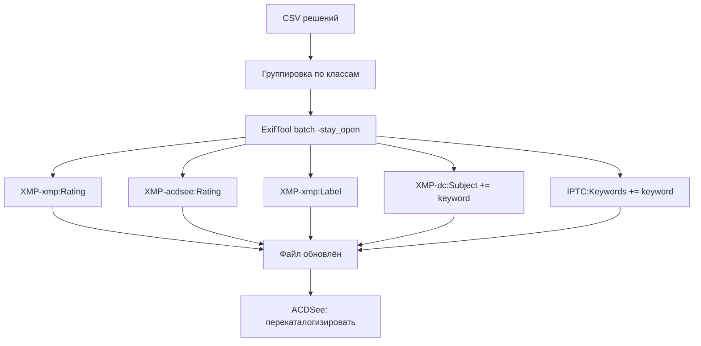

# Блок-схема системы Shadow-QC

## Общий пайплайн



## Модуль теневой маски



## Извлечение признаков



## Классификация



## Запись метаданных



## Структура проекта

```
shadow-qc/
├── config.yaml           ← пороги, пути, параметры
├── requirements.txt
├── src/
│   ├── __init__.py
│   ├── cli.py            ← argparse, точка входа
│   ├── pipeline.py       ← оркестрация всего
│   ├── features.py       ← вектор признаков
│   ├── shadow_mask.py    ← теневая маска
│   ├── classify.py       ← правила / ML
│   ├── metadata.py       ← ExifTool batch
│   └── utils.py          ← IO, resize, helpers
├── scripts/
│   ├── calibrate.py      ← калибровка на размеченном наборе
│   └── visualize_debug.py← overlay масок
├── data/
│   ├── input/            ← фото для обработки
│   ├── labeled.csv       ← ручная разметка
│   └── predictions.csv   ← результат
└── debug/
    ├── masks/
    └── overlays/
```

## Критерии приёмки

- [ ] CLI обрабатывает папку, выдаёт CSV с метриками и классами
- [ ] `--dry-run` не модифицирует файлы
- [ ] Без `--dry-run` пишет Rating/Label/Keywords в JPEG
- [ ] ACDSee видит и фильтрует по Rating и Keywords
- [ ] Debug-визуализация показывает теневую маску поверх фото
- [ ] Скорость: ≥5 кадров/сек на CPU (resize 1280)
- [ ] Пороги настраиваются через config.yaml без правки кода
